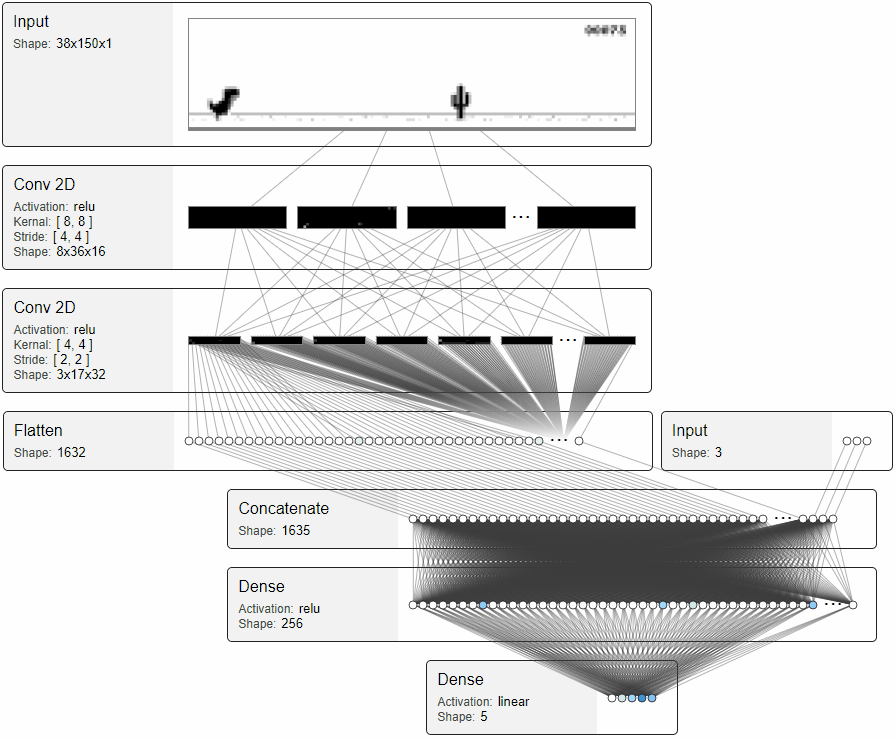

# Keras MRI
Keras MRI is a neural network visualization tool for Keras. This is still in Alpha and some networks and types of layers are not yet supported.

# Install

```sh
pip install keras-mri
```

# Usage

```python
import kmri

from keras.models import Sequential
from keras.layers import Dense

model = Sequential([
    Dense(8, input_shape=(3,))
])

input_batch = [[1,2,3], [7,8,9]]
kmri.visualize_model(model, input_batch)
```

Once this is running navigate to [http://127.0.0.1:5000/](http://127.0.0.1:5000/)

# Examples

The examples folder contains models that demonstrate keras-mri usage. To run one of the examples run the following from one of the example folders

```sh
pip install -r requirements.txt
python main.py
```

[**chrome-dino**](examples/chrome-dino/main.py)

Simple reinforcement learning model that learned to play the dinosaur game in chrome. Demonstrates visualizing a convolutional neural network with multiple inputs. This is based on [chrome-dino-ai](https://github.com/robianmcd/chrome-dino-ai).

 


[**img-classifier**](examples/img-classifier/main.py)

Demonstrates using keras-mri to visualize standard image classifieres like VGG, Inception, and ResNet. This is still a work in progress. 
 
# Development

**Install package locally**

```
pip install -e .
```

**Deploy**

```
# increase version number in setup.py
# commit and push
# Delete build, dist, and egg-info
python setup.py sdist bdist_wheel
python -m twine upload dist/*
```
